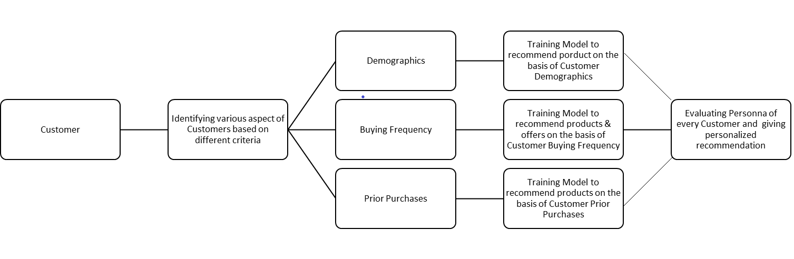
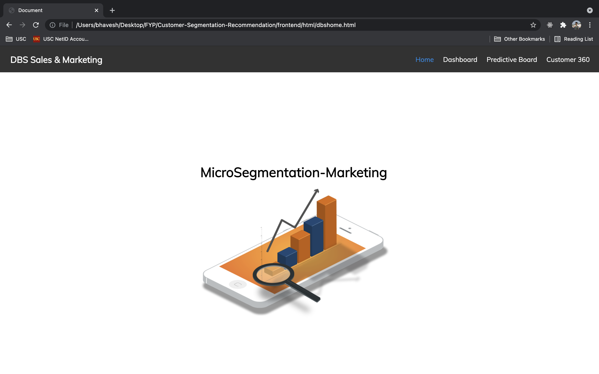
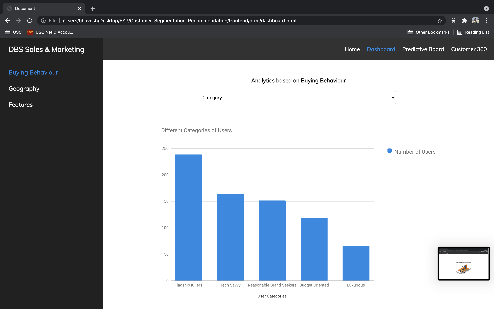
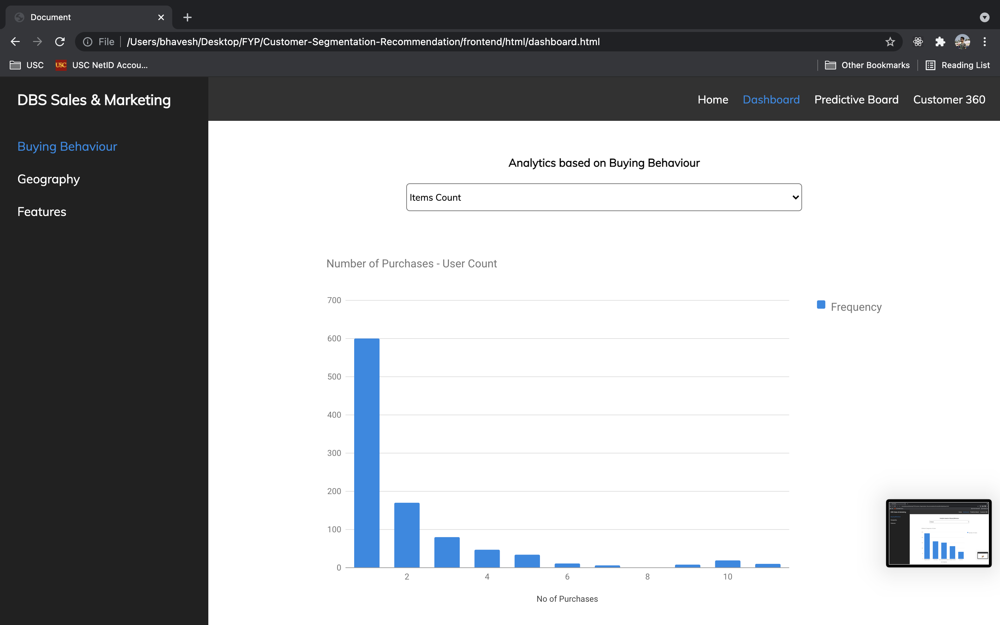
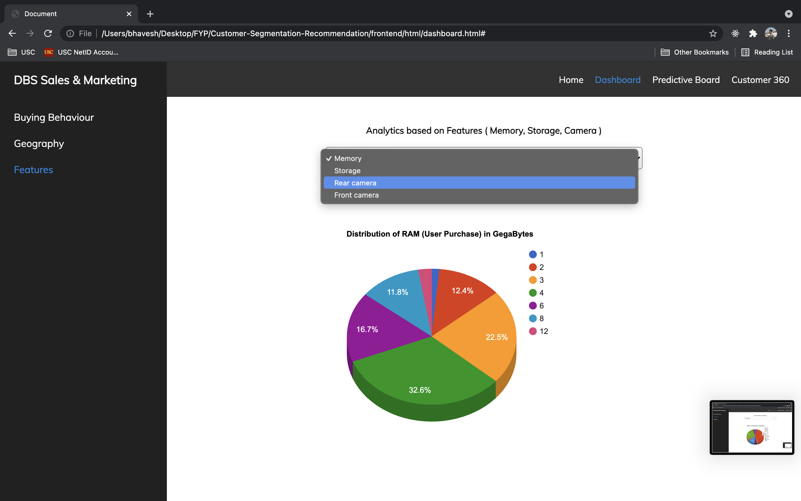
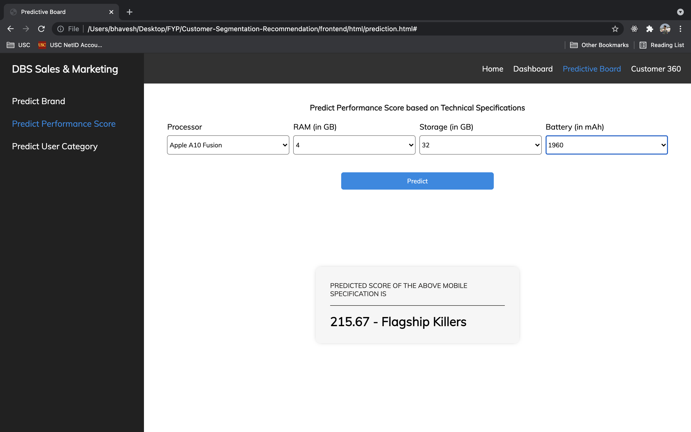
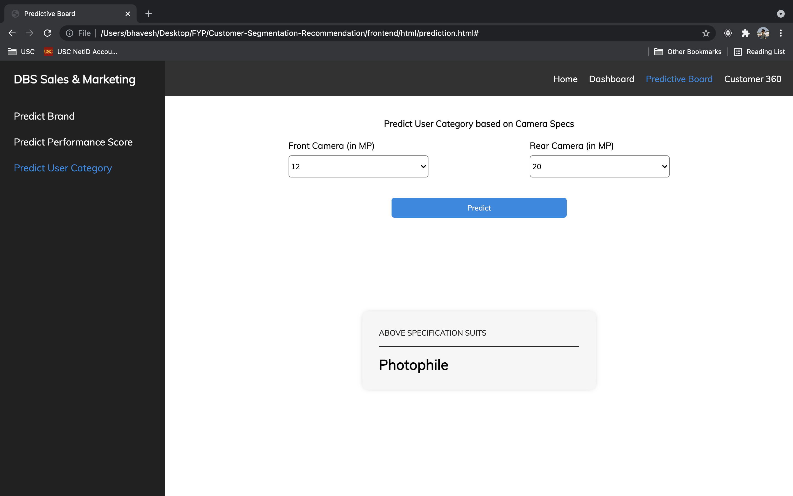
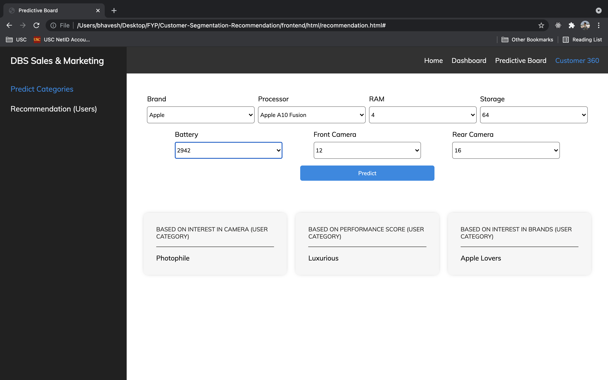

# Customer Segmentation Recommendation

### About

Customer Segmentation Recommendation is a Machine Learning based project which analyzes user data and preferences to provide product recommendations on a micro-segment level and also helps the marketing team in making better marketing-business strategy by analysing its customers, based on their buying behaviour.

Micro segmentation is the process of dividing a market of potential customers into groups, or segments, based on different characteristics.

#### Types of Market Segmentation:

- Demographic segmentation( age, gender, income, etc.)
- Psychographic segmentation( interests, lifestyle, etc.)
- Behavioral segmentation( purchase & spend habits, brand interactions, etc.)
- Geographic segmentation( city, country, etc.)

Based on data and after analysing, users were divided into various categories such as

- Tech (Tech Savy, Luxuorios, Flagship Killers, Others..)
- Brand Lovers (Apple, Samsung, Huawei, Others..)
- Camera Lovers (Sensible, PhotoPhile, SelfieLover)

### Technical Architecture

### Technology Stack

- Web Frontend developed using Html/css and Vanilla JavaScript

- Backend developed using Flask

- Machine Learning Classfication and Regression Algorithms, Neural Networks

- Models trained by scrapping data from the Internet

- Dataset comprises of users previous purchase history, product specifications, and user data on a micro-segment.
- - Data stored in excel

### Features

#### Marketing Head

- Analyse Buying Behavior of customers based on various paramters and divide them into various categories.
- Make better marketing strategy based on customers like/dislike for a particular product.
- Analyse a product sale and take actions to increase it.
- Predict the performance of their product based on its specification(in this case mobile phones).
- Target a specific audience based on product performance.
- Predict the audience that should be targeted on the given product.
- Recommend similar products to customers.

## Screenshots

### Dashboard (Analytics)

### Prediction (Performance and User Category)

### Recommendations

### Configure Project

- Install python on your machine
  python ver 3.5.9
  link to download : python.org/downloads/

- After successful installation of python, install following python libraries in your machine

       Package               Version
       --------------------- --------

       matplotlib            3.1.2
       missingno             0.4.2
       numpy                 1.18.1
       pandas                1.0.0
       sklearn               0.0
       tensorflow 2.0        1.15
       keras                 2.3.0
       seaborn               0.10.0
       flask                 1.1.1
       flask-Cors            3.0.8

       How to install?
       Open command prompt as administrator and type command pip install 'library-name'(For Windows)

- After successful installation of following libraries,navigate to the "DBS-Segmentation" folder where your project is kept,Open the folder and run "server.py" file
  Running this file will start the project server

- After successfully running "server.py" file, go to "frontend folder ->html folder ->dbshome.html",run "dbshome.html" file,thus the project will be setup successfully

- Inorder to have better understanding of code,install Anaconda-Navigator after that open jupyter-notebooks and open this folder "python-notebooks" on jupyter notebook and run files accordingly in that folder
